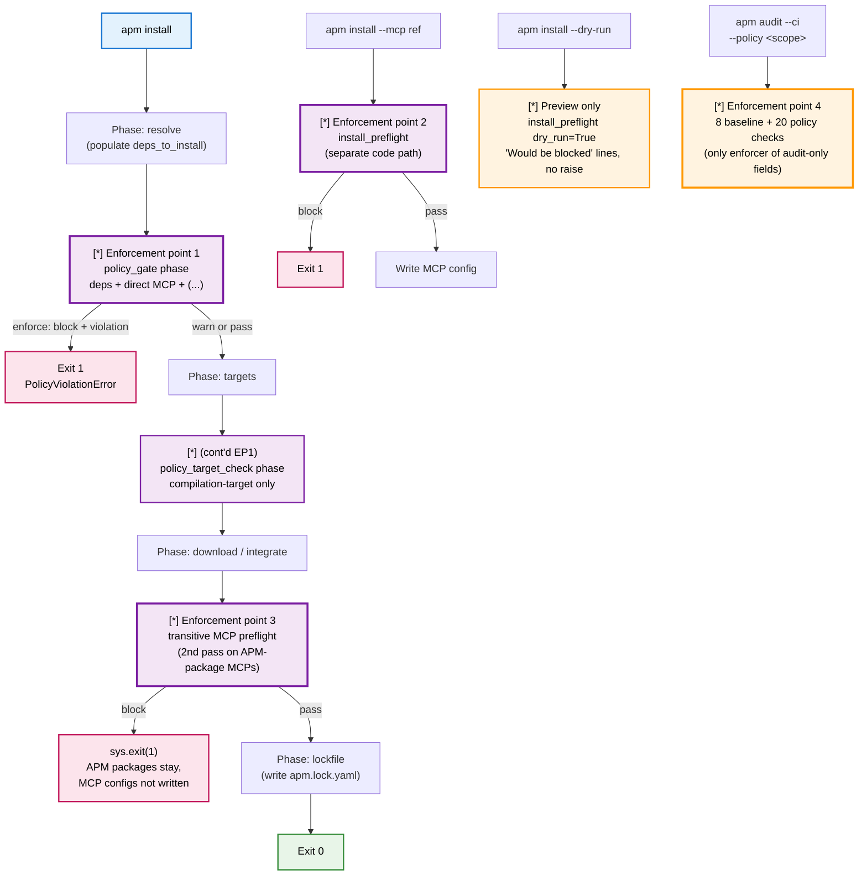
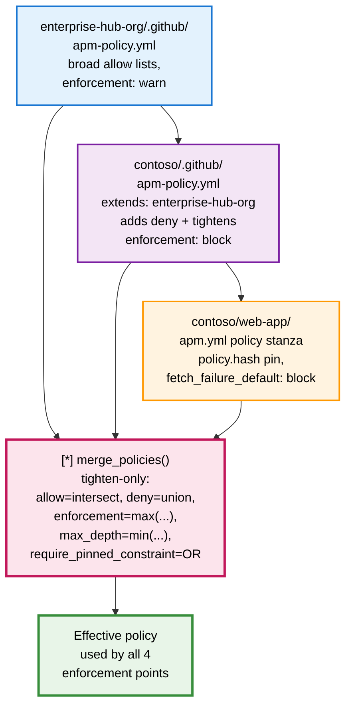
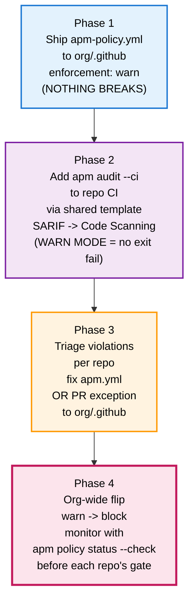
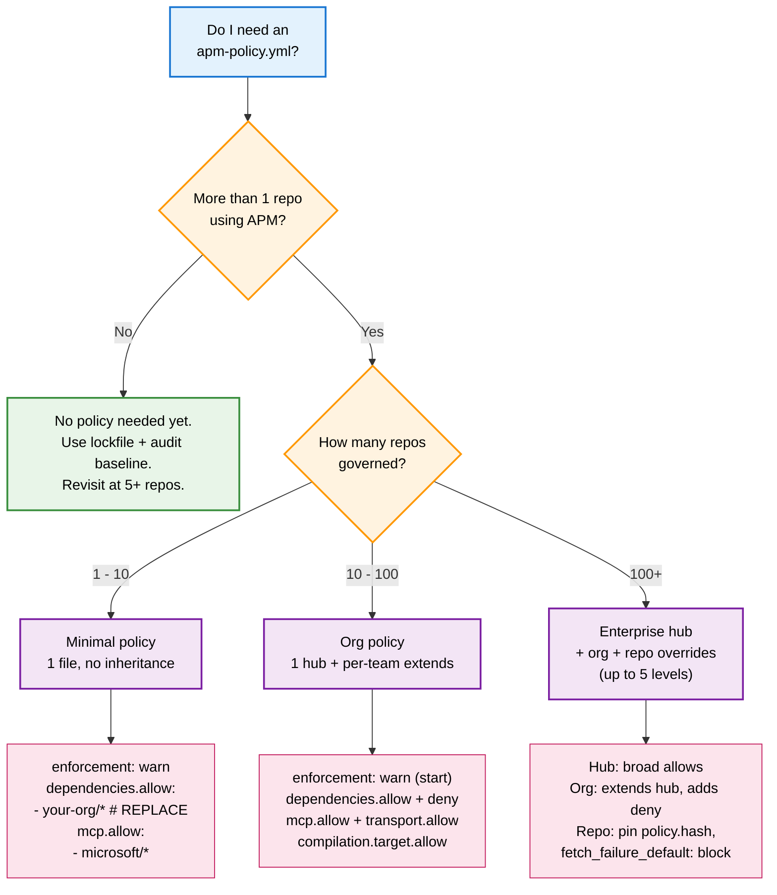

:::note[Policy Engine Maturity]
Lockfile-based governance (`apm.lock.yaml`, `apm audit` baseline) is **stable and production-ready**. The policy engine layer (`apm-policy.yml` enforcement via `apm install` gate and `apm audit --ci --policy`) is in **early preview** -- schema, inheritance, and discovery ship today; enforcement semantics may change between minor versions. Pin to a specific APM version before relying on it as a production gate.
:::

Twelve teams. Four agent stacks. One security review. Then it became 400 repos.

This guide is the spec for that scale. It tells you, with code-level honesty, exactly what APM governance can guarantee, where it can be bypassed, and which fields in the schema are not yet wired to enforcement. If you are deciding whether to make `apm audit --ci` a required check across an org, read sections 7, 8, and 14 first -- they own the bypass contract, the install-gate guarantee, and the known gaps.

---

## 1. Read this if

### For the CISO

You own the trust boundary and need defensible answers when an auditor asks "what was running, and who allowed it?"

APM gives you a git-tracked record of every agent dependency deployed (`apm.lock.yaml`) and a policy file your security team controls (`<org>/.github/apm-policy.yml`). The forensic answer to "what was active during the incident?" is one `git log` command. The trust boundary is your `.github` repo's branch protection.

Most relevant: section 7 (bypass contract), section 8 (install gate guarantees), section 12 (auditing the auditor), section 13 (enforcement audit log), section 14 (known gaps).

### For the VP of Engineering

You need to roll governance out across N repos without breaking the developer flow that earned you those N repos in the first place.

APM's policy engine is opt-in per repo until your org policy file lands in `<org>/.github`. The recommended path is `enforcement: warn` first, measure violations through GitHub Code Scanning, then flip to `block` once the noise is gone. Developers do code review; you don't ship a new tool. Air-gapped CI is supported with a one-line workaround.

Most relevant: section 1 (this), section 5 (enforcement points), section 9 (air-gapped), section 11 (rollout playbook).

### For the Platform Tech Lead

You will own the rollout, the policy YAML, the CI wiring, and the on-call escalation when a repo is unexpectedly blocked.

Read sections 5, 6, and 10 closely -- they tell you where enforcement runs, how policies merge, and what happens when the network is flaky. Section 9 gives you the offline matrix. Section 11 gives you the staged playbook. Section 14 is the list of sharp edges; budget for them.

Most relevant: section 5 (enforcement points), section 6 (composition), section 9 (air-gapped), section 10 (failure semantics), section 11 (rollout), section 14 (gaps).

---

## 2. The 30-second mental model

Two files do all the work:

- `apm.lock.yaml` -- what was deployed. Pinned to exact commit SHAs, git-tracked, regenerated by every `apm install`.
- `apm-policy.yml` -- what is allowed. Lives at `<org>/.github/apm-policy.yml`, auto-discovered from the project's git remote.

Four enforcement points read those files:

1. The `apm install` pipeline gate (after dependency resolve, before file targets).
2. The `apm install --mcp <ref>` direct-install preflight (separate code path).
3. The `apm install` transitive-MCP preflight (a second pass after APM packages resolve their own MCP dependencies).
4. `apm audit --ci [--policy <scope>]` (the only enforcer of the audit-only checks).

The trust boundary is your `<org>/.github` repository. CODEOWNERS and branch protection on that repo are what make the policy authoritative. Section 12 covers how to lock that down.

`apm compile` and `apm run` enforce zero policy. They trust the artifacts that `apm install` placed on disk. APM is an install-time gate, not a runtime sandbox.

APM addresses three structural problems in agent tooling: fragile context, manual setup, and ungoverned configuration. This guide is the spec for the third.

---

## 3. What you can govern

The scope matrix below is the contract. Every row maps a security or operational concern to the schema field that controls it, the named check that enforces it, and where that check actually runs. Rows marked `[i] audit-only` are NOT enforced by `apm install`; you must run `apm audit --ci --policy <scope>` in CI to enforce them. Rows marked `[!] parsed but not enforced` are accepted by the schema today but not consumed by any check -- treat them as forward-compatibility, not as live controls.

| Concern | Schema field | Check name | Install enforces | Audit enforces |
|---|---|---|---|---|
| Dependency allowlist | `dependencies.allow` | `dependency-allowlist` | Yes | Yes |
| Dependency denylist | `dependencies.deny` | `dependency-denylist` | Yes | Yes |
| Required packages present | `dependencies.require` | `required-packages`, `required-packages-deployed` | Yes | Yes |
| Required package version | `dependencies.require[].version` | `required-package-version` | Yes | Yes |
| Transitive depth cap | `dependencies.max_depth` | `transitive-depth` | Yes (when `< 50`) | Yes |
| Pinned dep constraints | `dependencies.require_pinned_constraint` | `dependency-pinned-constraint` | Yes (when `true`) | Yes |
| Registry source policy | `registry_source.require`, `.allow_non_registry` | `registry-source` | Yes | Yes |
| MCP server allowlist | `mcp.allow` | `mcp-allowlist` | Yes (direct + transitive) | Yes |
| MCP server denylist | `mcp.deny` | `mcp-denylist` | Yes (direct + transitive) | Yes |
| MCP transport allowlist | `mcp.transport.allow` | `mcp-transport` | Yes | Yes |
| Self-defined MCP control | `mcp.self_defined` | `mcp-self-defined` | Yes | Yes |
| Compilation target allowlist | `compilation.target.allow` (with `enforce: true`) | `compilation-target` | Yes (post-targets phase) | Yes |
| Compilation strategy | `compilation.strategy.enforce` | `compilation-strategy` | `[i] audit-only` | Yes |
| Source attribution | `compilation.source_attribution` | `source-attribution` | `[i] audit-only` | Yes |
| Required manifest fields | `manifest.required_fields` | `required-manifest-fields` | `[i] audit-only` | Yes |
| Manifest scripts policy | `manifest.scripts` | `scripts-policy` | `[i] audit-only` | Yes |
| Explicit manifest includes | `manifest.require_explicit_includes` | `explicit-includes` | `[i] audit-only` | Yes |
| Unmanaged files in governed dirs | `unmanaged_files.action`, `.directories` | `unmanaged-files` | `[i] audit-only` | Yes |
| Cache TTL override | `policy.cache.ttl` | -- | `[!] parsed but not enforced` (cache reader uses hardcoded 1h) | -- |
| Transitive MCP trust (policy field) | `mcp.trust_transitive` | -- | `[!] parsed but not enforced` (gate is the `--trust-transitive-mcp` CLI flag) | -- |
| Manifest content types | `manifest.content_types` | -- | `[!] parsed but not enforced` | -- |

The full schema and the canonical 8+20 check enumeration live in the [Policy Reference](./policy-reference/). The 8 baseline lockfile checks (lockfile presence, ref consistency, deployed files present, no orphaned packages, skill-subset consistency, MCP config consistency, content integrity, includes consent) run on every `apm audit --ci` regardless of policy and are non-bypassable -- they are covered in section 7.

`manifest.require_explicit_includes` (`bool`, default `false`) deserves a callout: when set to `true`, the `explicit-includes` check rejects any `apm.yml` that omits `includes:` or sets `includes: auto`. Use this when every published local file must be enumerated in the manifest and reviewable in PR diffs. See the [`includes` field](../reference/manifest-schema/#39-includes) for the three accepted forms.

---

## 4. What you cannot govern

Be clear with stakeholders about what is out of scope today:

- **Prompt and instruction content semantics.** APM scans for hidden Unicode (zero-width chars, bidirectional overrides) via `apm audit` content scanning. It does NOT do LLM-based prompt review, prompt-injection detection, or semantic safety review.
- **Runtime versions and model selection.** Policy does not constrain which LLM model an agent runs against, which Copilot version is installed locally, or which runtime executes the workflow.
- **MCP command and args content.** The MCP matcher only inspects the registry name (e.g. `microsoft/playwright`). It does not validate the `command:` or `args:` fields of a self-defined MCP server -- only the name and the self-defined flag.
- **File integration paths.** Where files land on disk inside the repo is decided by the integrators in each APM package. Policy cannot rewrite a package's file layout.
- **Custom agent tools beyond MCP.** If an agent stack ships its own non-MCP tool plugins, they sit outside policy scope. Govern them indirectly through `dependencies.allow`/`deny` and `unmanaged_files`.
- **Token scopes and OAuth scopes.** APM does not audit the scope of the GitHub PAT or app token used to fetch policies and packages. Manage that through the standard GitHub controls on the token issuer.
- **Anything `apm compile` or `apm run` does.** Those commands trust whatever `apm install` placed on disk. They do not re-check policy.

For the underlying threat model (what the content scanner protects against, MCP trust boundary, dependency provenance), see the [Security Model](./security/).

---

## 5. How enforcement works

Four enforcement points share one `route_discovery_outcome` table so the rules behave consistently regardless of entry point. The diagram below traces a single `apm install` invocation through the pipeline.



### 5a. Install pipeline gate

Runs after dependency resolution and before file targets. Enforces the dependency, MCP, and (post-targets) compilation-target rules against the resolved set. On `enforcement: block`, the CLI emits an inline `[x] Policy violation: ...` line per finding, raises `PolicyViolationError`, and aborts before any file is written. On `enforcement: warn`, every finding is recorded as a `[!]` warn diagnostic that surfaces in the end-of-install summary; install continues to completion.

### 5b. Install `--mcp <ref>` preflight

`apm install --mcp owner/repo` is a separate command branch that constructs a temporary MCP dependency and runs the preflight directly. Same checks as the gate (allow/deny/transport/self-defined) but a different code path. On block, the process exits with code 1 before any MCP config file is written.

### 5c. Install transitive MCP preflight

When you install an APM package that itself declares MCP dependencies, those MCPs are first resolved by the APM resolver and then passed through a SECOND policy preflight. APM packages already passed the gate, so on transitive-MCP block the APM packages stay installed but the MCP configs are NOT written and the process exits 1. This preserves the rule that no transitive MCP server reaches your runtime config without passing the same `mcp.*` rules as a direct one.

### 5d. `apm audit --ci --policy <scope>`

The only enforcer of the audit-only checks (`compilation-strategy`, `source-attribution`, `required-manifest-fields`, `scripts-policy`, `explicit-includes`, `unmanaged-files`). Runs the 8 baseline lockfile checks unconditionally, then -- if a policy is discovered or supplied -- runs the 20 policy checks. This is the check you wire into branch protection.

---

## 5a. What does NOT enforce policy

`apm compile`, `apm run`, and `apm pack` enforce zero organizational policy. They read what install placed on disk and proceed. If you assume "compile cannot bypass policy", that is only true because the artifacts compile reads were placed there by an `apm install` that DID enforce policy. Compile itself does not re-check.

This is the most commonly misunderstood point in the model. The four enforcement points listed in section 2 are exhaustive. Anything outside `apm install`, `apm install --mcp`, the transitive-MCP preflight, and `apm audit --ci` is trust-by-construction, not trust-by-check.

---

## 6. Policy composition (inheritance)

Policies can extend other policies up to 5 levels deep (`MAX_CHAIN_DEPTH = 5`, enforced both during the walk and after). Cross-host `extends:` is rejected at resolution time -- a policy on `github.com` cannot extend one on `ghe.example.com`, as a credential-leakage mitigation. Cycles are detected and refused. The merge is **tighten-only**: children can narrow allowlists, add deny entries, escalate enforcement, and shorten max depth, but never relax a parent constraint.



### Worked example

**Enterprise hub** -- `enterprise-hub-org/.github/apm-policy.yml`:

```yaml
name: "Enterprise baseline"
version: "1.0.0"
enforcement: warn
dependencies:
  allow:
    - "microsoft/*"
    - "contoso/*"
    - "partner-corp/*"
mcp:
  allow:
    - "microsoft/*"
  transport:
    allow: ["stdio", "http"]
```

**Org** -- `contoso/.github/apm-policy.yml`:

```yaml
name: "Contoso engineering"
version: "1.0.0"
extends: "enterprise-hub-org"
enforcement: block
dependencies:
  deny:
    - "untrusted-org/*"
mcp:
  transport:
    allow: ["stdio"]
  self_defined: deny
```

**Repo** -- `contoso/web-app/apm.yml`:

```yaml
packages:
  - name: contoso/web-standards
    version: "^1.0"
policy:
  hash: "sha256:abc123..."        # pin the fetched org policy
  fetch_failure_default: block    # fail-closed if discovery fails
```

**Effective policy** seen by every enforcement point in `contoso/web-app`:

| Field | Value | Why |
|---|---|---|
| `enforcement` | `block` | Org escalated `warn` -> `block` (`max(warn, block)`); repo cannot relax. |
| `dependencies.allow` | `microsoft/*`, `contoso/*`, `partner-corp/*` | Inherited from hub; org did not narrow it. Intersect rule (no child set means parent wins). |
| `dependencies.deny` | `untrusted-org/*` | Org added a deny; parent had none. Union rule. |
| `mcp.allow` | `microsoft/*` | Inherited from hub. |
| `mcp.transport.allow` | `stdio` | Org narrowed `[stdio, http]` to `[stdio]`. Intersect rule. |
| `mcp.self_defined` | `deny` | Org escalated. |

**Counter-example: a child cannot relax a parent.** If `contoso/web-app/apm.yml` tried to override the org's `block` back down to `warn`:

```yaml
policy:
  enforcement: warn   # rejected: org policy is block; child cannot relax
```

The merge rule for `enforcement` is `max(parent, child)` ordered `warn < block`, so the org's `block` wins. The child's `warn` is silently dropped from the effective policy. The same applies to allow-list widening (intersect rule) and deny-list removal (union rule): tightening flows down, relaxation does not.

For the full 12-row merge rule table, see [Tighten-only merge rules](./policy-reference/#tighten-only-merge-rules) in the Policy Reference.

---

## 7. The bypass / non-bypass contract

This is the certitude section. Read it twice if you are deciding whether `apm audit --ci` is good enough for branch protection.

| Surface | What it bypasses LOCALLY | What it CANNOT bypass | Reviewable in |
|---|---|---|---|
| `apm install --no-policy` | All install-time policy checks (incl. transitive MCP, hash pin) | The 8 baseline checks plus integration drift detection in `apm audit --ci` | git diff of `apm.lock.yaml` in PR |
| `APM_POLICY_DISABLE=1` env | Same as `--no-policy` plus the 20 audit policy checks | The 8 baseline checks plus integration drift detection in `apm audit --ci` | PR diff; CI env vars in Actions logs |
| Manual edit to `apm.lock.yaml` | Nothing; install regenerates the file each run | Audit baseline `ref-consistency` and `deployed-files-present` | git diff |
| Manual edit to deployed file post-install | Local file content until next audit | Audit baseline `content-integrity` (re-hashes deployed files); hidden-Unicode scan in `apm audit` content mode | git diff of the deployed file in PR |
| Direct `git clone` of an APM package, bypassing install | Everything; nothing detects out-of-band file drops | Audit baseline `no-orphaned-packages` and audit-only `unmanaged-files` | git diff |
| Fork repo to a personal org | Org policy auto-discovery (resolves to fork's `.github`) | Whatever your CI requires on the canonical repo | branch protection on canonical repo |
| `--trust-transitive-mcp` CLI flag | The transitive MCP preflight (second pass) | Direct MCP preflight; baseline content scan; audit MCP checks | CI command lines and Actions logs |
| `--allow-insecure` CLI flag | The HTTP-MCP refusal (lets a `http://` MCP through) | All `mcp.*` policy rules; audit MCP checks | CI command lines and Actions logs |
| `apm install --force` | On-disk collision detection AND content-scan blocks | The 20 policy checks; baseline checks at next audit | CI command lines; PR diff of overwritten files |

Notes on specific rows:

- **`apm install --no-policy`** also bypasses the `apm install --mcp` preflight, the transitive-MCP preflight, and any project-side `policy.hash` pin.
- **`APM_POLICY_DISABLE=1`** short-circuits discovery to `outcome="disabled"` everywhere -- including `apm audit --ci`, where the 20 policy checks are skipped (the 8 baseline checks and integration drift detection still run).
- **Manual lockfile edits**: `content_hash` mismatch on registry-proxy deps is caught at the next install when downloads resume.
- **Direct `git clone`**: `unmanaged-files` only flags governed dirs and only when configured to `warn` / `deny`.
- **Fork-to-personal-org**: discovery resolves via `git remote get-url origin`; branch protection on the upstream repo is the trust boundary.

**The non-bypass contract.** The 8 baseline lockfile checks (run by `apm audit --ci` *without* `--no-policy` or `APM_POLICY_DISABLE=1`) are unconditional. They do not consult the policy file, do not depend on org discovery, and are not affected by either escape hatch. Combined with branch protection that requires `apm audit --ci` to pass, no developer override is invisible: a `--no-policy` install leaves a lockfile that audit will reject if the result is inconsistent, and an `APM_POLICY_DISABLE=1` audit run cannot itself bypass the baseline checks. Every override appears in the PR diff, in the workflow file, or in the Actions environment configuration -- all of which are reviewable in code review.

**Workstation blast radius.** Because "file presence is execution" for agent files (an instruction or chat-mode file on disk is consumed by the agent runtime as soon as it is opened), the fork-to-personal-org bypass mitigates the *org's* trust gate but not the *individual workstation's*: between fork-clone-install and PR creation, the developer's machine already has the tainted files. Compensating control: an MDM-deployed mirror of `<org>/.github/apm-policy.yml` consulted by a wrapper script around `apm install`, or a workstation-level allowlist of permitted git remotes for APM-managed repos.

---

## 8. What the install gate guarantees -- precisely

These guarantees assume `APM_POLICY_DISABLE` is unset and `--no-policy` is not passed in the CI environment. See section 7 for the full bypass contract.

When `apm install` returns exit code 0 and the effective org policy is in `enforcement: block` mode, you ARE guaranteed:

- Every APM dependency declared in `apm.yml` matches `dependencies.allow` and is not matched by `dependencies.deny`.
- Every package in `dependencies.require` is present and at the required version (with one nuance: `require_resolution: project-wins` downgrades version mismatches to warnings, by design).
- Every direct MCP server matches `mcp.allow`, is not matched by `mcp.deny`, uses an allowed transport, and respects the `mcp.self_defined` rule.
- Every transitive MCP server discovered from APM packages was re-checked against the same `mcp.*` rules in a second pass (unless `--trust-transitive-mcp` was passed).
- Compilation targets that would be written match `compilation.target.allow` (when `enforce: true` on that field).
- The fetched policy file matched any `policy.hash` pin in `apm.yml`. If the hash did not match, install failed closed regardless of `fetch_failure_default` -- hash-mismatch is unconditionally fail-closed in non-dry-run install paths. (`apm install --dry-run` logs the mismatch but does not exit non-zero -- see section 14 gap.)
- The lockfile (`apm.lock.yaml`) was regenerated from the resolved, gated set.

You are NOT guaranteed:

- That files on disk are still what install wrote. `apm install` itself does not re-verify deployed files; drift is caught by `apm audit --ci` baseline `content-integrity` (re-hashes against `deployed_file_hashes`).
- That prompt or instruction content is semantically safe. Only the hidden-Unicode scan runs.
- That the audit-only checks (`compilation-strategy`, `source-attribution`, `required-manifest-fields`, `scripts-policy`, `unmanaged-files`) passed. Run `apm audit --ci --policy <scope>` in CI for those.
- That non-APM files in the repo conform to anything. APM only governs files it placed.
- Anything about runtime behavior. APM is install-time only.
- That a `policy.cache.ttl` shorter or longer than 1 hour took effect. The cache reader uses a hardcoded 1-hour TTL; the `policy.cache.ttl` field is parsed but not honored.

---

## 9. Air-gapped and offline

This section covers offline **policy** enforcement (the `apm-policy.yml` cache). For offline **dependency traffic** (routing installs through Artifactory), see [Registry Proxy & Air-gapped](./registry-proxy/).

**For air-gapped CI, run `apm audit --ci --policy ./vendored-policy.yml` as your gating check; do not rely on `apm install` enforcement.**

| Network state | Install gate | Install `--mcp` | `apm audit --ci --policy <file>` | `apm audit --ci` (auto-discovery) |
|---|---|---|---|---|
| Online | Discovers + enforces | Discovers + enforces | Loads from path, enforces | Discovers + enforces |
| Cache fresh (< 1h) | Cache hit, enforces | Cache hit, enforces | n/a (file path skips cache) | Cache hit, enforces |
| Cache stale (1h - 7d) | Refresh attempted; on fail, `cached_stale` outcome -- proceed with cached unless `policy.fetch_failure: block` | Same | n/a | Same |
| Offline, cache > 7d | `cache_miss_fetch_fail` -- fail-OPEN by default; fail-closed only if `policy.fetch_failure_default: block` in `apm.yml` | Same | Loads from path, full enforce | Same as install -- also covers `no_git_remote` / `absent` / `empty` outcomes when `policy.fetch_failure_default: block` |

Workarounds when the network is unreliable:

- **Audit in CI is fully offline-capable** with `apm audit --ci --policy /path/to/vendored-policy.yml`. The `--policy` argument accepts a local file path and bypasses GitHub discovery entirely. Vendor your org policy into the repo (or a sidecar mount) and audit works in any air-gapped environment.
- **Install does not have a `--policy <path>` flag.** This is a known gap (section 14). The current workaround is `extends: <internal-mirror-url>` from a reachable `<org>/.github/apm-policy.yml`, but the leaf is still fetched via the GitHub API.
- **Cache prewarm** for repeatable offline builds. The cache lives at `<project_root>/apm_modules/.policy-cache/<key>.yml` where `<key>` is `sha256(repo_ref)[:16]`. Prewarming means stashing valid `<key>.yml` and `<key>.meta.json` files in that directory before install runs.
- **Make policy fail-closed offline.** Set `policy.fetch_failure_default: block` in your project `apm.yml`. With this set, network failure or a malformed policy aborts install instead of warning. Combine with `policy.hash` to detect a tampered mirror.

---

## 10. Failure semantics

| Outcome | Default behavior | Override to fail-closed | Citation |
|---|---|---|---|
| Network failure (`cache_miss_fetch_fail`) | Fail-OPEN, log warning, install proceeds with no policy | `policy.fetch_failure_default: block` in `apm.yml` | [policy-reference#95-network-failure-semantics](./policy-reference/#95-network-failure-semantics) |
| Cached stale (1h - 7d, refresh failed) | Warn and proceed with cached policy | `policy.fetch_failure: block` set in the cached policy itself | [policy-reference#95-network-failure-semantics](./policy-reference/#95-network-failure-semantics) |
| Malformed YAML (`malformed`) (org policy file) | Fail-OPEN by default | `policy.fetch_failure_default: block` | `policy/parser.py` |
| **No policy resolved (`no_git_remote` / `absent` / `empty`)** | **Fail-OPEN, log warning** | `policy.fetch_failure_default: block` in `apm.yml` -- applies to BOTH `apm install` and `apm audit --ci` | [policy-reference#951-no-policy-outcomes](./policy-reference/#951-no-policy-outcomes-no_git_remote--absent--empty) |
| Hash-mismatch (project pin vs fetched) | **Always fail-CLOSED** | n/a (cannot be relaxed) | [policy-reference#95-network-failure-semantics](./policy-reference/#95-network-failure-semantics) |
| Garbage response | Fail-OPEN by default | `policy.fetch_failure_default: block` | [policy-reference#95-network-failure-semantics](./policy-reference/#95-network-failure-semantics) |
| Malformed project manifest (`manifest_parse`) | **Always fail-CLOSED** | n/a (cannot be relaxed) | `policy/policy_checks.py`, `policy/ci_checks.py` |
| `extends:` cycle detected | Fail-CLOSED, raises `PolicyInheritanceError` | n/a | `policy/inheritance.py` |
| Cross-host `extends:` rejected | Fail-CLOSED, raises before any fetch | n/a (security mitigation, cannot be relaxed) | `policy/discovery.py` |

Why fail-open is the default for fetch failures: the design choice is to not break the developer flow on a transient network blip. A developer on a flaky hotel WiFi who runs `apm install` should not be locked out. The trade-off is that compliance-critical environments must explicitly opt into fail-closed via `policy.fetch_failure_default: block`. Combine that with `policy.hash` and a CI environment that is expected to be online, and the result is: any policy that does not fetch cleanly and match the pin aborts the build.

Hash-mismatch is the one outcome that can never be overridden. If your `apm.yml` pins `policy.hash: sha256:...` and the fetched policy hashes to something else, install fails closed unconditionally. This is the defense against silent mirror tampering or upstream policy drift you have not approved.

**On-call quick reference:**

- `cache_miss_fetch_fail` outcome -> network; check egress to api.github.com; verify cache dir writable.
- `hash_mismatch` outcome -> SUSPECTED TAMPER; do not override; investigate org policy commit history.
- `cached_stale` outcome -> normal if recently degraded network; force refresh with `apm policy status --no-cache`.

> Reminder: `apm policy status` ALWAYS exits 0 by default -- it is a
> diagnostic, not a gate. Use `apm policy status --check` to make CI
> fail when no usable policy is found, and `apm audit --ci` to gate
> on rule violations.
- `extends rejected` outcome -> cross-host extends; remove non-canonical host from `apm-policy.yml` extends chain.

---

## 11. Rolling out without breaking N repos

The phased playbook below assumes you have an existing fleet of repos and need to introduce policy without surprise breakages. Each phase is independently committable and reversible.



**Phase 1 -- ship a warn-mode policy.** Land `apm-policy.yml` in `<org>/.github` with `enforcement: warn`. Nothing breaks anywhere. Every `apm install` in the org now discovers the policy, runs the checks, and logs `[!]` warnings for violations -- but proceeds.

**Phase 2 -- wire audit into CI.** Use a shared GitHub Actions template (or composite action) that runs `apm audit --ci --policy org -f sarif` and uploads the SARIF to GitHub Code Scanning. Violations become visible to repo owners as code-scanning alerts. Be honest with stakeholders here: in `warn` mode, audit rewrites violations to `passed=True` so the exit code stays 0. CI does not fail. The visibility is in the SARIF + Code Scanning UI, not in the green/red check. Branch protection cannot enforce yet.

Minimal workflow steps (drop into `.github/workflows/apm-audit.yml`):

```yaml
jobs:
  apm-audit:
    runs-on: ubuntu-latest
    permissions:
      contents: read
      security-events: write
    steps:
      - uses: actions/checkout@v4
      - uses: actions/setup-python@v5
        with: { python-version: "3.12" }
      - run: pip install apm-cli==X.Y.Z  # REPLACE: pin to current version, see /installation
      - run: apm install
      - run: apm audit --ci -f sarif --output apm-audit.sarif
      - uses: github/codeql-action/upload-sarif@v3
        with: { sarif_file: apm-audit.sarif }
```

For richer customization (matrix builds, monorepo splits, vendored policy paths) see the [Enforce in CI guide](./enforce-in-ci/).

:::caution[Warn mode does not fail CI]
`apm audit --ci` in warn mode rewrites violations to `passed=True` (audit.py:589-598), so the audit command exits 0 even on policy violations. Visibility is in the SARIF upload + Code Scanning UI, not in branch-protection status. To gate merges on policy violations, you must run in `block` mode.
:::

**Phase 3 -- triage and clean up.** Repo owners either fix their `apm.yml` to comply with the policy, or they open a PR to `<org>/.github/apm-policy.yml` to add an explicit allow entry with rationale. The PR flow is the policy change-management trail (see section 12).

**Phase 4 -- flip to block.** Once Code Scanning shows the violation backlog is drained, change `enforcement: block` in `<org>/.github/apm-policy.yml`. Stage by team if the org is large: a team can adopt block early by setting `enforcement: block` in its own team-level intermediate policy, leaving the org policy at `warn`. (Tighten-only merge means the team's `block` wins for repos under that team's `extends:` chain.) Use `apm policy status --check` in CI as a pre-flight that explains the effective policy and surfaces what would be blocked, before the gate phase actually blocks it.

**Circuit-breaker rollout for large fleets.** For 100+ repos, do not flip block org-wide in one commit. Stage: enable `block` for 10% of repos for 1 week (via team-level extends), monitor SARIF alert volume and on-call pages, expand to 50% for 1 week, then 100%. If SARIF volume spikes or on-call escalations cluster, revert to `warn` at the org level (one commit) while you triage.

For step-by-step CI YAML and SARIF upload examples beyond the snippet above, see the [Enforce in CI guide](./enforce-in-ci/).

---

## 12. Auditing the auditor

The org policy file is the trust root. Protecting it is on you, not on APM.

- **CODEOWNERS on `<org>/.github/apm-policy.yml`** -- restrict to a security team. Every change requires their review.
- **Branch protection on `<org>/.github` main** -- required reviewers, no force push, no direct push to main, dismiss stale approvals on new commits.
- **GitHub Ruleset on the org `.github` repo** (recommended) -- requires approval from a specific team for any change to policy files. See [GitHub Rulesets](../integrations/github-rulesets/).
- **Change history is `git log apm-policy.yml`.** Rationale lives in commit messages and PR descriptions. Make commit-message rationale a CODEOWNERS-checked review item.
- **Policy change cooling period** (recommended) -- every change to `apm-policy.yml` requires a PR with rationale and a 24-72 hour waiting period before merge. This is a process control, not a code control, but it is the single most important thing you can add.

**Separation of duties for SOX / SOD-sensitive environments.** CODEOWNERS for `apm-policy.yml` should require approvals from a team distinct from the team authoring the change. Configure GitHub Rulesets on the `<org>/.github` repo to require reviewers from `@org/policy-approvers`, where that team is disjoint from `@org/policy-authors`. The same author cannot self-approve, and the approval team has no commit rights to the policy file directly.

**Lint for bypass flags in CI workflows.** Add a pre-merge check that fails any PR introducing a policy-bypass flag without an explicit security review label:

```bash
# Pre-merge lint: detect policy-bypass flags in CI workflows
grep -rEn '(--no-policy|--force|APM_POLICY_DISABLE|--trust-transitive-mcp|--allow-insecure)' .github/workflows/ \
  && { echo "Policy bypass flag detected; requires security review"; exit 1; } || true
```

`--force` is included because it bypasses the pre-deploy hidden-Unicode security scan (see section 7); teams may choose to allow it locally for developer ergonomics but it should never appear in CI workflows without security review.

When a reviewer asks "who approved this policy change and why?", the forensic answer is one git command:

```bash
git -C <org>/.github log --follow --patch -- apm-policy.yml
```

For lockfile-side forensic recipes (`git log apm.lock.yaml`, `git show <sha>:apm.lock.yaml`, etc.), see the [Lockfile Spec](../reference/lockfile-spec/).

---

## 13. The enforcement audit log

Two complementary trails answer two different questions:

- **`apm.lock.yaml` git history** answers *what configurations existed*. Every `apm install` regenerates it; every change is committed; `git log` is the deployment log.
- **GitHub Code Scanning (SARIF)** answers *what was blocked or warned*. `apm audit --ci -f sarif` emits SARIF; the GitHub Actions `upload-sarif` step writes it to Code Scanning. This is the durable record of enforcement decisions.

Retention follows GitHub Advanced Security policy: alerts persist on the repository indefinitely; alert state changes (resolved, dismissed) are tracked. Code Scanning alerts on closed PRs follow the standard ~30-day retention for ephemeral PR analyses; alerts on the default branch persist until dismissed. For SOC 2 / ISO 27001 7-year retention requirements, export SARIF to your SIEM (Splunk HEC, Azure Monitor, S3 + Athena) -- APM emits the SARIF, customer pipelines persist it.

Querying the SARIF audit log with the `gh` CLI (the REST API; `gh code-scanning` is not a built-in subcommand):

```bash
# Filter alerts by rule (e.g. dependency-denylist) across the repo
gh api /repos/{owner}/{repo}/code-scanning/alerts \
  --paginate -q '.[] | select(.rule.id == "dependency-denylist")'

# Filter by state (open, dismissed, fixed) -- the change-management evidence trail
gh api /repos/{owner}/{repo}/code-scanning/alerts \
  --paginate -q '.[] | select(.state == "dismissed")'
```

Distinct from the lockfile audit log: the lockfile records what files were deployed and from which commit. SARIF records what the policy gate decided. A complete audit answer for an incident usually needs both: "the lockfile shows package X at commit Y was deployed on date Z, and SARIF shows that the policy check for that package passed under policy version V."

---

## 14. Known gaps and limitations

We publish this list because silent gaps are worse than known ones. Every item below names the operational mitigation available today. No proprietary governance vendor will give you this list -- that's the point.

These are the sharp edges. Plan around them; do not assume they are solved.

- **`policy.cache.ttl` field is parsed but not honored.** The cache reader uses a hardcoded 1-hour TTL. Setting `policy.cache.ttl: 86400` in your policy will be silently ignored. Operational mitigation: do not rely on this field; assume 1-hour cache TTL universally.
- **`mcp.trust_transitive` policy field is parsed but not enforced.** The transitive-MCP gate is the `--trust-transitive-mcp` CLI flag, NOT the policy field. Operational mitigation: govern transitive MCP trust through CI command lines and code review of workflow files, not through policy YAML.
- **`manifest.content_types` field is parsed but no check enforces it.** Operational mitigation: do not advertise this field as a control to stakeholders.
- **Audit-only checks are not enforced at install.** `compilation-strategy`, `source-attribution`, `required-manifest-fields`, `scripts-policy`, `explicit-includes`, and `unmanaged-files` only run under `apm audit --ci --policy <scope>`. Operational mitigation: make `apm audit --ci` a required status check in branch protection. Without that, these rules are advisory only.
- **`apm compile` and `apm run` do not re-check policy.** They trust install. Operational mitigation: ensure that no compile or run step in CI is reachable without a preceding `apm install` that ran the gate.
- **`apm audit --ci` in `warn` mode rewrites violations to `passed=True`.** Warn mode never fails CI exit. The visibility is in the SARIF output, not the exit code. Operational mitigation: monitor Code Scanning alerts during the warn-mode rollout phase; do not assume CI green means "no policy violations" while in warn mode.
- **`apm install` has no `--policy <path>` flag.** Only `apm audit` does. This is the air-gapped install gap. Operational mitigation: use `extends:` from a reachable mirror, or run audit (which does support `--policy <path>`) as the gating check and skip install-time enforcement in air-gapped CI.
- **Non-GitHub remotes are not auto-discovered.** If your project's `git remote get-url origin` points to ADO, GitLab, or a plain git host, policy auto-discovery falls through with no policy applied. Operational mitigation: pass `apm audit --ci --policy <path-or-url>` explicitly in those CI environments.
- **Trust anchor is `git remote get-url origin`.** A developer who pushes the project to a personal org will have policy discovery resolve `<their-org>/.github/apm-policy.yml` -- which they control. Operational mitigation: branch protection on the canonical repo is the trust boundary; nothing about a personal fork can bypass what your CI requires before merge.
- **`apm install --dry-run` silently downgrades hash-mismatch.** In dry-run, `raise_blocking_errors=False` (outcome_routing.py:104-119) causes the mismatch to surface as `discovery_miss` with no "Would be blocked" line and exit 0. Operational mitigation: rely on `apm audit --ci` in CI for hash-pin verification, not on `apm install --dry-run`.
- **`apm audit --ci --no-policy` and `APM_POLICY_DISABLE=1` skip policy checks.** The 20 policy checks are bypassed in audit, but the 8 baseline lockfile checks still run. Operational mitigation: keep bypass flags out of required CI workflows; the bypass contract in section 7 is authoritative.
- **Gate + transitive-MCP preflight may double-emit the same MCP violation.** A single bad transitive MCP can produce two SARIF alerts with the same rule and different code paths. Operational mitigation: dedupe by `(rule_id, server_name)` when aggregating alerts in your SIEM or dashboard.
- **No signed attestation that the gate ran.** APM does not currently produce a signed (e.g. SLSA / sigstore) attestation for the install gate or the audit run. Non-repudiation depends on the GitHub Actions audit log plus branch-protection enforcement of the required check. Operational mitigation: pair APM with branch protection requiring `apm audit --ci` as a status check; rely on GitHub's audit log for auditor evidence.

For features that would close these gaps, watch the [CHANGELOG](https://github.com/microsoft/apm/blob/main/CHANGELOG.md) and the policy-engine experimental status.

---

## 15. Decision tree



**Minimal policy (1-10 repos)** -- one file at `<org>/.github/apm-policy.yml`:

```yaml
name: "Starter policy"
version: "1.0.0"
enforcement: warn
dependencies:
  allow:
    - "your-org/*"        # REPLACE: your GitHub org name
mcp:
  allow:
    - "microsoft/*"
```

**Org policy (10-100 repos)** -- start similar, then add denies and target enforcement as you learn what to constrain:

```yaml
name: "Contoso engineering"
version: "1.0.0"
enforcement: warn
dependencies:
  allow: ["microsoft/*", "contoso/*"]
  deny: ["untrusted-org/*"]
mcp:
  allow: ["microsoft/*", "contoso/*"]
  transport:
    allow: ["stdio"]
compilation:
  target:
    allow: ["copilot", "claude"]
    enforce: true
```

**Hub + org + repo (100+ repos)** -- enterprise hub with broad allows, org extending and tightening, repos pinning the hash:

```yaml
# enterprise-hub-org/.github/apm-policy.yml
name: "Enterprise baseline"
version: "1.0.0"
enforcement: warn
dependencies:
  allow: ["microsoft/*", "contoso/*", "partner-corp/*"]

# contoso/.github/apm-policy.yml
extends: "enterprise-hub-org"
enforcement: block
dependencies:
  deny: ["untrusted-org/*"]

# contoso/web-app/apm.yml
policy:
  hash: "sha256:abc123..."
  fetch_failure_default: block
```

---

## 16. Where to next

:::tip[Starting a pilot?]
**15-minute path:** copy `templates/apm-policy-starter.yml` to `<your-org>/.github/apm-policy.yml`, wire the CI YAML from section 11 Phase 2, ship in warn mode. Flip to block once SARIF is clean.
:::

- [`apm-policy.yml`](./apm-policy/) -- the file's mental model.
- [Enforce in CI](./enforce-in-ci/) -- step-by-step CI wiring with YAML.
- [Policy Reference](./policy-reference/) -- complete schema, the canonical 8+20 check enumeration, the 12-row merge rule table, exit codes.
- [Security Model](./security/) -- threat model, MCP trust boundary, content scanning, token handling.
- [Adoption Playbook](./adoption-playbook/) -- broader APM rollout (governance is one phase).
- [Lockfile Spec](../reference/lockfile-spec/) -- lockfile schema for forensic queries.
- [GitHub Rulesets](../integrations/github-rulesets/) -- enforcing audit as a required check.
- [Lockfile Spec](../reference/lockfile-spec/) -- companion reference covering the lockfile audit trail and forensic recipes.
