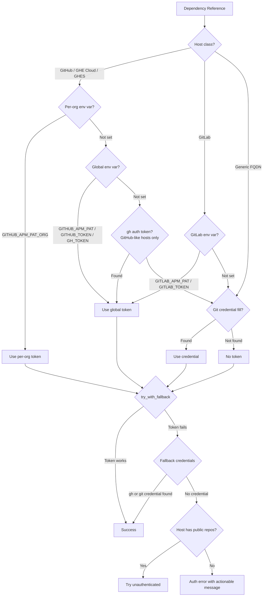

APM works without tokens for public packages on github.com. Authentication is needed for private repositories, enterprise hosts (`*.ghe.com`, GHES), GitLab (private or API access), and Azure DevOps.

## How APM resolves authentication

APM resolves tokens per `(host, port, org)` pair. For each dependency, it walks a **host-class-specific** chain until it finds a token:

1. **GitHub-class hosts** (`github.com`, `*.ghe.com`, GHES via `GITHUB_HOST`): **Per-org env var** `GITHUB_APM_PAT_{ORG}` (when an org slug applies), then **global** `GITHUB_APM_PAT` -> `GITHUB_TOKEN` -> `GH_TOKEN`, then **GitHub CLI active account** (`gh auth token --hostname <host>`, silently skipped if `gh` is not installed or not logged in for the host), then host-specific **git credential helper**.
2. **GitLab-class hosts** (`gitlab.com`, or FQDNs listed via `GITLAB_HOST` / `APM_GITLAB_HOSTS`): **only** `GITLAB_APM_PAT` -> `GITLAB_TOKEN`, then host-specific **git credential helper**. GitHub token env vars are **not** used for GitLab (including `GITHUB_APM_PAT`, `GITHUB_TOKEN`, and `GH_TOKEN`, and `GITHUB_APM_PAT_{ORG}` for group/namespace paths).
3. **Generic hosts** (other FQDNs such as Bitbucket): host-specific **git credential helper** or unauthenticated/public access -- **no** GitHub or GitLab platform env vars.

Azure DevOps uses its own chain (`ADO_APM_PAT` -> Azure CLI bearer). See [Azure DevOps](#azure-devops).
If the resolved token fails for the target host, APM retries with git credential helpers on paths that support it. If nothing matches, APM attempts unauthenticated access where the host exposes public repos (not *ghe.com* Data Residency).

Results are cached per-process for each `(host, port, org)` key. All token-bearing requests use HTTPS.

## Token lookup
### GitHub-class hosts (`github.com`, `*.ghe.com`, GHES via `GITHUB_HOST`)

| Priority | Variable | Scope | Notes |
|----------|----------|-------|-------|
| 1 | `GITHUB_APM_PAT_{ORG}` | Per-org | Org name uppercased, hyphens -> underscores |
| 2 | `GITHUB_APM_PAT` | Global | Falls back to git credential helpers if rejected |
| 3 | `GITHUB_TOKEN` | Global | Often set in GitHub Actions |
| 4 | `GH_TOKEN` | Global | Often set by `gh auth login` |
| 5 | `gh auth token --hostname <host>` | Per-host | Active `gh auth login` account; silently skipped if `gh` is missing or not logged in |
| 6 | `git credential fill` | Per-host | System credential manager, OS keychain |

### GitLab-class hosts (`gitlab.com`, `GITLAB_HOST`, `APM_GITLAB_HOSTS`)

| Priority | Variable | Notes |
|----------|----------|-------|
| 1 | `GITLAB_APM_PAT` | Preferred dedicated variable for APM + GitLab |
| 2 | `GITLAB_TOKEN` | CI / automation-friendly name (`CI_JOB_TOKEN`, etc.) |
| 3 | `git credential fill` | Host-scoped HTTPS credentials |

**GitLab exclusion:** GitHub PAT env vars (`GITHUB_APM_PAT`, `GITHUB_APM_PAT_{ORG}`, `GITHUB_TOKEN`, `GH_TOKEN`) are **never** chosen for GitLab-class hosts — even if set — because they commonly appear in unrelated contexts (for example Actions) and must not be sent to GitLab as `PRIVATE-TOKEN` or HTTPS credentials.

### Generic hosts (e.g. Bitbucket, self-hosted SCM that is not GitLab-class)

| Priority | Source | Notes |
|----------|--------|-------|
| 1 | `git credential fill` | Configure credentials for that host in git |

For Azure DevOps, APM resolves `ADO_APM_PAT`, then an Entra ID (AAD) bearer token from Azure CLI (`az`). See [Azure DevOps](#azure-devops).

For Artifactory registry proxies, use `PROXY_REGISTRY_TOKEN`. See [Registry proxy (Artifactory)](#registry-proxy-artifactory).

For dedicated APM registries (`registries:` block in `apm.yml`), use `APM_REGISTRY_TOKEN_{NAME}`. See [Registry tokens](#registry-tokens) below.

For Copilot/runtime token variables (`GITHUB_COPILOT_PAT`, etc.), see [Agent Workflows](../../guides/agent-workflows/).

### Configuration variables

| Variable | Purpose |
|----------|---------|
| `APM_GIT_CREDENTIAL_TIMEOUT` | Timeout in seconds for `git credential fill` (default: 60, max: 180) |
| `GITHUB_HOST` | Default host for bare package names (e.g., GHES hostname) |

## Multi-org setup

When your manifest pulls from multiple GitHub organizations, use per-org env vars:

```bash
export GITHUB_APM_PAT_CONTOSO=ghp_token_for_contoso
export GITHUB_APM_PAT_FABRIKAM=ghp_token_for_fabrikam
```

The org name comes from the dependency reference — `contoso/my-package` checks `GITHUB_APM_PAT_CONTOSO`. Naming rules:

- Uppercase the org name
- Replace hyphens with underscores
- `contoso-microsoft` → `GITHUB_APM_PAT_CONTOSO_MICROSOFT`

Per-org tokens take priority over global tokens. Use this when different orgs require different PATs (e.g., separate SSO authorizations).

## Multi-account Git Credential Manager

APM forwards the repository path to `git credential fill`, so [Git Credential Manager (GCM)](https://github.com/git-ecosystem/git-credential-manager) can automatically pick the right GitHub account per organization -- no account-picker prompt. Existing single-account setups are unaffected: if `credential.useHttpPath` is not enabled, git credential helpers ignore the `path` attribute and match per host only.

To opt in, enable path-aware matching once:

```bash
git config --global credential.useHttpPath true
```

GCM (v2.1+) matches credential URLs by **prefix**, so a single config entry per org typically covers every repo under that org:

```bash
git config --global credential.https://github.com/acme.username your-acme-account
git config --global credential.https://github.com/personal-org.username your-personal-account
```

With the entries above, fetches against `acme/widgets`, `acme/payments`, and any other `acme/*` repo all resolve to `your-acme-account` without per-repo configuration. Other credential helpers (and older GCM versions) may require an exact path match -- consult your helper's documentation if a per-org entry is not picked up.

### Seeing an account picker mid-install?

If `apm install` triggers a GCM account-picker dialog while resolving a private repo:

1. Confirm `credential.useHttpPath` is set globally: `git config --global --get credential.useHttpPath` should print `true`.
2. Confirm a per-URL entry exists for the org: `git config --global --get-urlmatch credential https://github.com/<org>` should list the username.
3. Re-run with `--verbose`; APM logs `trying git credential fill for <host> (path=<owner>/<repo>)` so you can confirm the path APM is sending matches your config entry.

## Fine-grained PAT setup

Fine-grained PATs (`github_pat_`) are scoped to a **single resource owner** — either a user account or an organization. A user-scoped fine-grained PAT **cannot** access repos owned by an organization, even if you are a member of that org.

To access org packages, create the PAT with the **org** as the resource owner at [github.com/settings/personal-access-tokens/new](https://github.com/settings/personal-access-tokens/new).

Required permissions:

| Permission | Level | Purpose |
|------------|-------|---------|
| **Metadata** | Read | Validation and discovery |
| **Contents** | Read | Downloading package files |

Set **Repository access** to "All repositories" or select the specific repos your manifest references.

**Alternatives that skip scoping entirely:**

- `gh auth login` — produces an OAuth token that inherits your full org membership. Easiest zero-config path.
- Classic PATs (`ghp_`) — inherit the user's membership across all orgs. GitHub is deprecating these in favor of fine-grained PATs.

## Enterprise Managed Users (EMU)

EMU orgs can live on **github.com** (e.g., `contoso-microsoft`) or on **GHE Cloud Data Residency** (`*.ghe.com`). EMU tokens are standard PATs (`ghp_` classic or `github_pat_` fine-grained) — there is no special prefix. They are scoped to the enterprise and cannot access public repos on github.com.

Fine-grained PATs for EMU orgs **must** use the EMU org as the resource owner — a user-scoped fine-grained PAT will not work. See [Fine-grained PAT setup](#fine-grained-pat-setup).

If your manifest mixes enterprise and public packages, use separate tokens:

```bash
export GITHUB_APM_PAT_CONTOSO_MICROSOFT=github_pat_enterprise_token  # EMU org
```

Public repos on github.com work without authentication. Set `GITHUB_APM_PAT` only if you need to access private repos or avoid rate limits.

### GHE Cloud Data Residency (`*.ghe.com`)

`*.ghe.com` hosts are always auth-required — there are no public repos. APM skips the unauthenticated attempt entirely for these hosts:

```bash
export GITHUB_APM_PAT_MYENTERPRISE=ghp_enterprise_token
apm install myenterprise.ghe.com/platform/standards
```

## GitHub Enterprise Server (GHES)

Set `GITHUB_HOST` to your GHES instance. Bare package names resolve against this host:

```bash
export GITHUB_HOST=github.company.com
export GITHUB_APM_PAT_MYORG=ghp_ghes_token
apm install myorg/internal-package  # → github.company.com/myorg/internal-package
```

Use full hostnames for packages on other hosts:

```yaml
dependencies:
  apm:
    - team/internal-package                   # → GITHUB_HOST
    - github.com/public/open-source-package   # → github.com
```

Setting `GITHUB_HOST` makes bare package names (without explicit host) resolve against your GHES instance. Alternatively, skip env vars and configure `git credential fill` for your GHES host.

## Azure DevOps

The recommended way to authenticate with Azure DevOps is via `az login`:

```bash
az login --tenant <your-tenant-id>
apm install dev.azure.com/myorg/myproject/myrepo
```

Alternatively, set an explicit PAT:

```bash
export ADO_APM_PAT=your_ado_pat
apm install dev.azure.com/myorg/myproject/myrepo
```

ADO is always auth-required. Uses 3-segment paths (`org/project/repo`). No `ADO_HOST` equivalent - always use FQDN syntax:

```bash
apm install dev.azure.com/myorg/myproject/myrepo#main
apm install mycompany.visualstudio.com/org/project/repo  # legacy URL

# Sub-path inside an ADO repo, pinned to a tag (use the _git form for sub-paths):
apm install dev.azure.com/myorg/myproject/_git/myrepo/instructions/security#v2.0
```

If your ADO project or repository name contains spaces, URL-encode them as `%20`:

```bash
apm install dev.azure.com/myorg/My%20Project/_git/My%20Repo%20Name
```

Create the PAT at `https://dev.azure.com/{org}/_usersSettings/tokens` with **Code (Read)** permission.

### Authenticating with Microsoft Entra ID (AAD) bearer tokens

When your org has disabled PAT creation (managed-identity-only orgs, locked-down enterprise tenants), APM can use an AAD bearer token issued by the Azure CLI instead. No env var is required: APM picks up the token from your active `az` session on demand.

**Prerequisite:** install the [Azure CLI](https://aka.ms/installazurecli) and sign in against the tenant that owns the org:

```bash
az login --tenant <your-tenant-id>
apm install dev.azure.com/myorg/myproject/myrepo
```

**Finding your tenant ID:** if you are unsure which tenant owns the ADO org, visit `https://dev.azure.com/{org}/_settings/organizationAad` in a browser, or ask your admin. You can also run `az login` without `--tenant` and inspect `az account show --query tenantId -o tsv`.

**Resolution precedence for ADO hosts** (`dev.azure.com`, `*.visualstudio.com`):

1. `ADO_APM_PAT` env var if set
2. AAD bearer via `az account get-access-token` if `az` is installed and signed in
3. Otherwise: auth-failed error with guidance for both paths

**Stale-PAT fallback:** if `ADO_APM_PAT` is set but rejected (HTTP 401), APM silently retries with the `az` bearer and emits:

```
[!] ADO_APM_PAT was rejected for dev.azure.com (HTTP 401); fell back to az cli bearer.
[!]     Consider unsetting the stale variable.
```

This fallback applies to all ADO operations including `apm install --update`. If you have a stale `ADO_APM_PAT` but an active `az login` session, `apm install --update` will succeed transparently via the bearer retry.

If both `ADO_APM_PAT` and the `az` bearer fail, APM emits:

```
[x] AAD bearer fallback also failed for dev.azure.com.
```

This confirms both paths were attempted and neither succeeded, so the fix is either to refresh your PAT or run `az login`.

**Verbose output** (`--verbose`) shows which source was used per host:

```
[i] dev.azure.com -- using bearer from az cli (source: AAD_BEARER_AZ_CLI)
[i] dev.azure.com -- token from ADO_APM_PAT
```

Bearer tokens are short-lived (~60 minutes), acquired on demand, never persisted by APM. See [Security Model: Token handling](../../enterprise/security/#token-handling) for the full posture.

### Auth-failure diagnostics

When authentication fails, APM prints a targeted diagnostic instead of a generic "not accessible or doesn't exist" message. The diagnostic tells you exactly which path failed and what to do next. For `--update` operations, APM verifies auth *before* modifying any files -- if the pre-flight check fails, you will see `No files were modified` and your `apm.yml`, `apm.lock.yaml`, and `apm_modules/` directory remain untouched.

## GitLab (SaaS and self-managed)

### Host classification

APM must classify a host as GitLab to use **GitLab REST v4** (for example `marketplace.json` fetches and install-time single-file reads). Configuration mirrors GHES-style host overrides:

| Variable | Purpose |
|----------|---------|
| `GITLAB_HOST` | One self-managed GitLab FQDN (e.g. `git.company.com`) |
| `APM_GITLAB_HOSTS` | Several self-managed GitLab FQDNs, comma-separated |

`gitlab.com` is detected automatically. For GitLab-class hosts, resolved credentials follow **`GITLAB_APM_PAT` → `GITLAB_TOKEN`** and then **`git credential fill`** (see [GitLab-class hosts](#gitlab-class-hosts-gitlabcom-gitlab_host-apm_gitlab_hosts) under [Token lookup](#token-lookup)). GitHub PAT env vars are not used on GitLab. Use a GitLab personal or project access token with API read access where your policy requires it.

### REST headers (GitLab vs GitHub)

For GitHub and GHES, APM sends repository API requests with `Authorization: token <PAT>` (or equivalent). For **GitLab REST v4**, PATs are sent with the **`PRIVATE-TOKEN`** header (GitLab’s convention). OAuth-style access tokens can use `Authorization: Bearer` when applicable. APM does not log token values.

## Package source behavior

| Package source | Host | Auth behavior | Fallback |
|---|---|---|---|
| `org/repo` (bare) | `default_host()` | Global env vars -> `gh auth token` -> credential fill | Unauth for public repos |
| `github.com/org/repo` | github.com | Global env vars -> `gh auth token` -> credential fill | Unauth for public repos |
| `contoso.ghe.com/org/repo` | *.ghe.com | Global env vars -> `gh auth token` -> credential fill | Auth-only (no public repos) |
| GHES via `GITHUB_HOST` | ghes.company.com | Global env vars -> `gh auth token` -> credential fill | Unauth for public repos |
| GitLab (`gitlab.com` or host listed in `GITLAB_HOST` / `APM_GITLAB_HOSTS`) | gitlab.com or self-managed | `GITLAB_APM_PAT` -> `GITLAB_TOKEN` -> credential helper; REST uses `PRIVATE-TOKEN`; GitHub env vars excluded | Unauth where the instance allows it |
| `dev.azure.com/org/proj/repo` | ADO | `ADO_APM_PAT` -> AAD bearer via `az` | Auth-only |
| Artifactory registry proxy | custom FQDN | `PROXY_REGISTRY_TOKEN` | Error if `PROXY_REGISTRY_ONLY=1` |

## Registry proxy (Artifactory)

Air-gapped environments route all VCS traffic through a JFrog Artifactory proxy. APM supports this via three env vars:

| Variable | Purpose |
|----------|---------|
| `PROXY_REGISTRY_URL` | Full proxy base URL, e.g. `https://art.example.com/artifactory/github` |
| `PROXY_REGISTRY_TOKEN` | Bearer token for the proxy |
| `PROXY_REGISTRY_ONLY` | Set to `1` to block all direct VCS access -- only proxy downloads allowed |

```bash
export PROXY_REGISTRY_URL=https://art.example.com/artifactory/github
export PROXY_REGISTRY_TOKEN=your_bearer_token
export PROXY_REGISTRY_ONLY=1    # optional -- enforces proxy-only mode

apm install
```

When `PROXY_REGISTRY_URL` is set, APM rewrites download URLs to go through the proxy and sends `PROXY_REGISTRY_TOKEN` as the `Authorization: Bearer` header instead of the GitHub PAT.

### Lockfile and reproducibility

After a successful proxy install, `apm.lock.yaml` records the proxy host and path prefix as separate fields:

```yaml
dependencies:
  - repo_url: owner/repo
    host: art.example.com        # pure FQDN -- no path
    registry_prefix: artifactory/github  # path prefix
    resolved_commit: abc123def456
```

Subsequent `apm install` runs (without `--update`) read these fields to reconstruct the proxy URL and route auth to `PROXY_REGISTRY_TOKEN`, ensuring byte-for-byte reproducibility without needing the original env vars to be set identically.

### Proxy-only enforcement

With `PROXY_REGISTRY_ONLY=1`, APM will:

1. Validate the existing `apm.lock.yaml` at startup and exit with an error if any entry is locked to a direct VCS source (no `registry_prefix`)
2. Skip the download cache for entries that have no `registry_prefix` (forcing a fresh proxy download)
3. Raise an error for any package reference that does not route through the configured proxy

### Deprecated Artifactory env vars

The following env vars still work but emit a `DeprecationWarning`. Migrate to the `PROXY_REGISTRY_*` equivalents:

| Deprecated | Replacement |
|------------|-------------|
| `ARTIFACTORY_BASE_URL` | `PROXY_REGISTRY_URL` |
| `ARTIFACTORY_APM_TOKEN` | `PROXY_REGISTRY_TOKEN` |
| `ARTIFACTORY_ONLY` | `PROXY_REGISTRY_ONLY` |

## Registry tokens

Dedicated APM registries (declared in `apm.yml`, `~/.apm/config.json`, or both) use a dedicated env-var prefix that is **distinct** from `GITHUB_APM_PAT_*`, `PROXY_REGISTRY_*`, and `ARTIFACTORY_APM_TOKEN` — there is no collision with Git auth.

Package registries are experimental. Run `apm experimental enable registries` before using these tokens with registry-sourced dependencies.

| Env var | Auth method |
|---|---|
| `APM_REGISTRY_TOKEN_{NAME}` | `Authorization: Bearer <token>` |
| `APM_REGISTRY_USER_{NAME}` + `APM_REGISTRY_PASS_{NAME}` | `Authorization: Basic <base64(user:pass)>` |

`{NAME}` is the registry name, uppercased, with `-` and `.` mapped to `_` (e.g. `jf-skills` -> `JF_SKILLS`). When both forms are set, Bearer wins. When neither is set, APM tries the request anonymously and surfaces a remediation message on `401`/`403`.

:::caution[Silent auth failures]
A misspelled env var is indistinguishable from a missing token — APM attempts anonymous access and only reports auth failure from the server. Names `corp-main` and `corp.main` map to the same `APM_REGISTRY_TOKEN_CORP_MAIN`; do not register both. See [Registries guide — pitfalls](../../guides/registries/#pitfalls).
:::

Token precedence (highest wins): `APM_REGISTRY_TOKEN_{NAME}` env var → `registry.<name>.token` in `~/.apm/config.json`.

```bash
export APM_REGISTRY_TOKEN_JF_SKILLS=eyJ...
# or persist locally:
apm config set registry.jf-skills.token eyJ...
apm install
```

For the full registry workflow — declaring registries, scoping dependencies, and lockfile semantics — see the [Registries guide](../../guides/registries/).

## Troubleshooting

### Rate limits on github.com

APM tries unauthenticated access first for public repos to conserve rate limits during validation (e.g., checking if a repo exists). For downloads, authenticated requests are preferred — with unauthenticated fallback for public repos on github.com. If you hit rate limits, set any token:

```bash
export GITHUB_TOKEN=ghp_any_valid_token
```

### SSO-protected organizations

Authorize your PAT for SSO at [github.com/settings/tokens](https://github.com/settings/tokens) — click **Configure SSO** next to the token.

### EMU token can't access public repos

EMU PATs use standard prefixes (`ghp_`, `github_pat_`) — there is no EMU-specific prefix. They are enterprise-scoped and cannot access public github.com repos. Use a standard PAT for public repos alongside your EMU PAT — see [Enterprise Managed Users (EMU)](#enterprise-managed-users-emu) above.

### Fine-grained PAT can't access org repos

Fine-grained PATs are scoped to one resource owner. If you created the PAT under your **user account**, it cannot access repos owned by an organization — even if you are an org member. Recreate the PAT with the **org** as the resource owner. Classic PATs (`ghp_`) and `gh auth login` OAuth tokens do not have this limitation. See [Fine-grained PAT setup](#fine-grained-pat-setup).

### Diagnosing auth failures

Run with `--verbose` to see the full resolution chain:

```bash
apm install --verbose your-org/package
```

The output shows which env var matched (or `none`), the detected token type (`fine-grained`, `classic`, `oauth`, `github-app`), and the host classification (`github`, `ghe_cloud`, `ghes`, `ado`, `gitlab`, `generic`).

The full resolution and fallback flow (simplified):



### Git credential helper not found

APM calls `git credential fill` as a fallback (60s timeout). If your credential helper needs more time (e.g., Windows account picker), set `APM_GIT_CREDENTIAL_TIMEOUT` (seconds, max 180):

```bash
export APM_GIT_CREDENTIAL_TIMEOUT=120
```

Ensure a credential helper is configured:

```bash
git config credential.helper              # check current helper
git config --global credential.helper osxkeychain  # macOS
gh auth login                              # GitHub CLI
```

#### Custom-port hosts and per-port credentials

For self-hosted Git instances on non-standard ports (e.g. Bitbucket Datacenter on port 7999), APM sends `host=<host>:<port>` to `git credential fill` per the [`gitcredentials(7)`](https://git-scm.com/docs/gitcredentials) protocol. Whether distinct credentials are returned for different ports depends on the helper:

| Helper | Honors port-in-host? |
|---|---|
| git-credential-manager (GCM) | Yes |
| macOS Keychain (`osxkeychain`) | Yes (stores full `host:port` as key) |
| `libsecret` (Linux) | Yes (port in URI) |
| `gh auth git-credential` | No -- but only used for GitHub hosts, which do not use custom ports |

If APM resolves the wrong credential for a custom-port host, confirm your helper keys by `host:port`; otherwise either switch helpers or store credentials under fully qualified `https://<host>:<port>/` URLs.

### SSH connection hangs on corporate/VPN networks

When APM clones over SSH (because the dependency is an SSH URL, the user
passed `--ssh`, `git config url.<base>.insteadOf` rewrites to SSH, or
`--allow-protocol-fallback` is in effect), firewalls that silently drop SSH
packets (port 22) can make `apm install` appear to hang. APM sets
`GIT_SSH_COMMAND="ssh -o ConnectTimeout=30"` so SSH attempts fail within 30
seconds.

If you already set `GIT_SSH_COMMAND` (e.g., for a custom key), APM appends
`-o ConnectTimeout=30` unless `ConnectTimeout` is already present in your
value.

If SSH is unreachable from your network, force HTTPS:

```bash
apm install --https
export APM_GIT_PROTOCOL=https
```

## Choosing transport (SSH vs HTTPS)

Authentication and transport are independent decisions:

- **HTTPS** uses the token resolution chain documented above. APM resolves a
  token per `(host, org)` and embeds it in the clone URL.
- **SSH** uses your existing ssh-agent and `~/.ssh/config`. APM does not
  select keys or override agent behavior -- whatever `git clone` would do
  on the same machine, APM does.

APM picks the transport per dependency using a strict contract (explicit
URL scheme honored exactly; shorthand uses HTTPS unless
`git config url.<base>.insteadOf` rewrites it to SSH). For the full
selection matrix, the `--ssh` / `--https` flags, the `APM_GIT_PROTOCOL`
env var, and the `--allow-protocol-fallback` escape hatch, see
[Dependencies: Transport selection](../../guides/dependencies/#transport-selection-ssh-vs-https).

:::caution[Custom ports and cross-protocol fallback]
When `--allow-protocol-fallback` is in effect, APM reuses the
dependency URL's port on both SSH and HTTPS attempts. On servers that
use different ports per protocol (e.g. Bitbucket Datacenter: SSH 7999,
HTTPS 7990), the off-protocol URL will be wrong. APM emits a `[!]`
warning before the first clone attempt to flag this. To avoid
cross-protocol retries, leave `--allow-protocol-fallback` disabled
(strict mode) and pin the dependency with an explicit `ssh://...` or
`https://...` URL. If the flag is enabled, APM may still try the
other protocol even when the URL uses an explicit scheme.
:::
